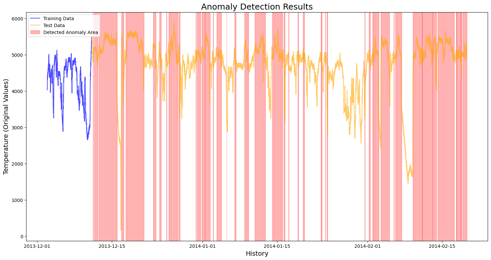

# LSTM Autoencoder for Anomaly Detection

A deep learning project to detect anomalies in machine temperature data. This model learns the "normal" operational behavior of a machine and identifies patterns that could signal a system failure.

## Final Result

The model was trained *only* on normal data. It successfully identified all 4 major failure events in the test data (shown as red shaded areas) while correctly ignoring normal operational periods.



*(Note: The `final_result.png` image must be placed in the `images/` folder for this to display correctly.)*

## Tech Stack

* **Python**
* **TensorFlow & Keras** (for the LSTM Autoencoder)
* **Pandas** (for data handling)
* **Scikit-Learn** (for `MinMaxScaler`)
* **Seaborn & Matplotlib** (for visualization)

## How to Run

1.  **Clone the repository:**
    ```bash
    git clone [https://github.com/](https://github.com/)vedatozturk/LSTM-Anomaly-Detection].git
    cd LSTM-Anomaly-Detection
    ```

2.  **Install key libraries:**
    You will need the libraries listed in the "Tech Stack" section (like `tensorflow`, `pandas`, `sklearn`, `seaborn`).
    ```bash
    pip install tensorflow pandas scikit-learn seaborn matplotlib
    ```

3.  **Run the notebook:**
    Open and run the `anomaly_detection.ipynb` notebook to see the full analysis, from data cleaning to final results.

## Methodology

This project uses an **LSTM Autoencoder**.
1.  The **Encoder** learns to compress a time-series window (60 steps) into a small summary.
2.  The **Decoder** learns to reconstruct the original window *only* from that summary.
3.  By training on "normal" data, the model gets very good at reconstructing normal patterns (low error).
4.  When an **anomaly** occurs, the model fails to reconstruct it accurately, resulting in a high "reconstruction error" (high MAE loss), which triggers our alarm.
